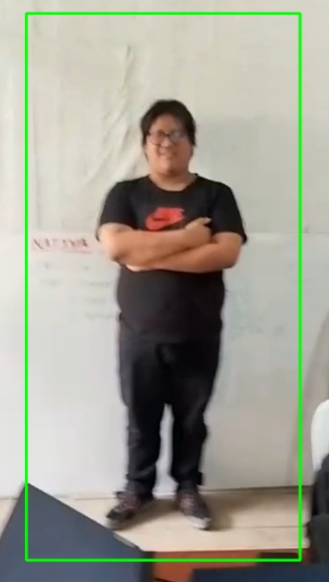
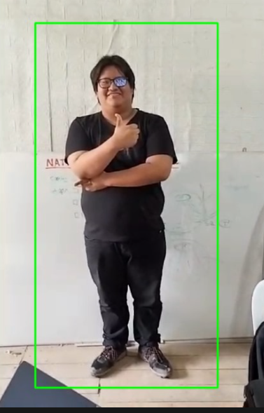

# Detector de Cuerpos con Python y OpenCV

Este proyecto implementa un detector de cuerpos en tiempo real utilizando el lenguaje de programación Python y la biblioteca de visión por computadora OpenCV. Es capaz de procesar el flujo de video de una cámara, identificar la presencia de cuerpos completos en cada fotograma y resaltar las detecciones con rectángulos.

| Detección en Acción 1 | Detección en Acción 2 |
| :-------------------: | :-------------------: |
|  |  |

## Tecnologías Utilizadas

* **Python:** Lenguaje de programación principal utilizado para el desarrollo del detector.
* **OpenCV (Open Source Computer Vision Library):** Biblioteca fundamental para el procesamiento de imágenes y video en tiempo real. Específicamente, se utiliza para:
    * Acceder y capturar el flujo de video de la cámara.
    * Realizar operaciones de preprocesamiento de imágenes (como la conversión a escala de grises).
    * Cargar y utilizar clasificadores pre-entrenados (Haar Cascades) para la detección de objetos (cuerpos completos en este caso).
    * Dibujar formas (rectángulos) sobre los fotogramas para visualizar las detecciones.
    * Mostrar la salida de video procesada.
* **Clasificadores Haar Cascade:** Un método de detección de objetos basado en aprendizaje automático que utiliza características de tipo Haar. OpenCV proporciona un archivo XML pre-entrenado (`haarcascade_fullbody.xml`) para la detección de cuerpos completos.

## Instalación de OpenCV

Para poder ejecutar este proyecto, necesitarás tener Python y OpenCV instalados en tu sistema.

1.  **Asegúrate de tener Python instalado.** Puedes descargarlo desde [python.org](https://www.python.org/). Se recomienda una versión reciente de Python 3.

2.  **Instala OpenCV usando pip.** Abre tu terminal o línea de comandos y ejecuta el siguiente comando:

    ```bash
    pip install opencv-python
    ```

    Este comando descargará e instalará la biblioteca principal de OpenCV.

## Uso

1.  Clona o descarga este repositorio.
2.  Asegúrate de tener una cámara conectada y configurada.
3.  Ejecuta el script principal de Python
4.  Se abrirá una ventana mostrando el video de tu cámara con los cuerpos detectados resaltados.
5.  Presiona la tecla 'q' para cerrar la ventana y finalizar el programa.
